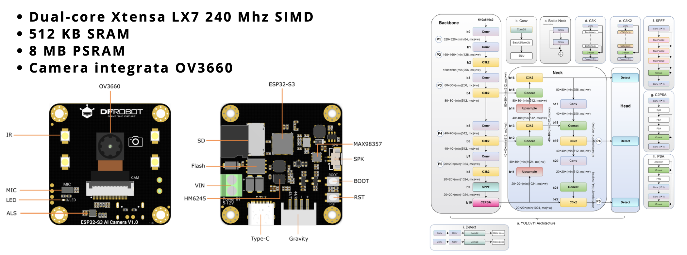
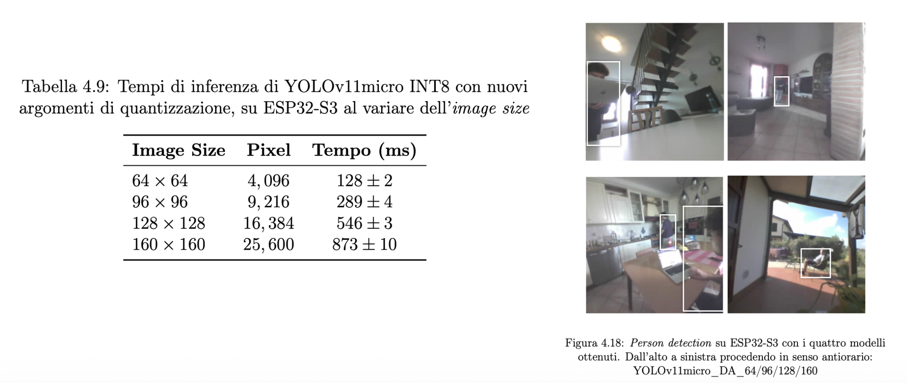

## Embedded Object Detection on ESP32-S3: optimization and deployment for edge computing

This repository contains my **Bachelor's Thesis** project for my degree in Computer Science at the University of Bologna.
This work was supervised by Giorgio Tsiotas and Luciano Bononi, and is available in the [University Institutional Repository](https://amslaurea.unibo.it/id/eprint/36867/).

 
*The ESP32-S3 board and the YOLO11 architecture used in the project*


Here, you will find all the code involved, from the developed firmware for the ESP32-S3, to the Python notebooks used for the experiments. You can also access the complete [thesis PDF](Bachelor's%20Thesis/Thesis.pdf) and the [presentation slides](Bachelor's%20Thesis/Presentation.pdf) (in Italian), as well as a [short video](https://drive.google.com/file/d/1xOA4kC95pYEfBjaSd9R0f_NA7AFryewA/view?usp=drive_link) of the thesis defense.

### The Project in summary
Deploying deep learning models on embedded systems and edge devices is a crucial yet challenging task. The Edge AI and TinyML movements emerged to address this gap, offering enhanced privacy, lower latency, reduced network dependency, and improved energy efficiency, all on low-cost hardware. This thesis explores the deployment and execution of a You Only Look Once (YOLO) model directly on an ESP32-S3 (equipped with an OV3660 camera module), a microcontroller with severely limited resources but a very low market cost. 

The first part of the project focused on firmware development in C++ using the FreeRTOS real-time operating system. This enabled concurrent task execution across the chip's dual cores to manage the camera and run the inference engine efficiently. The second and final phase was dedicated to the optimization and deployment of a YOLO11 object detection model. This involved Post-Training Quantization, model scaling, and a custom training pipeline designed for resolution and domain adaptation. For further details, please refer to the complete [thesis PDF](Bachelor's%20Thesis/Thesis.pdf).

See the synthetic [documentation](documentation/documentation.md)  and [rapid commands](documentation/fastCommands.txt) for useful information to run and use the project locally.

 
*Inference time in milliseconds and qualitative results of the final models*

### Support this work
You can support this project by leaving a star on this repository.
You can also cite my thesis if you find it useful for your work.

```bibtex
@phdthesis{amslaurea36867,
    title = {Embedded Object Detection su ESP32-S3: ottimizzazione e deployment per l'Edge},
    author = {Prato, Alessio},
    school = {University of Bologna},
    type = {Bachelor's thesis},
    year = {2025},
    keywords = {Object Detection, Edge AI, Embedded Systems, Computer Vision, YOLO},
    url = {https://amslaurea.unibo.it/id/eprint/36867/}
}
```

Thank you for taking the time to read through!


